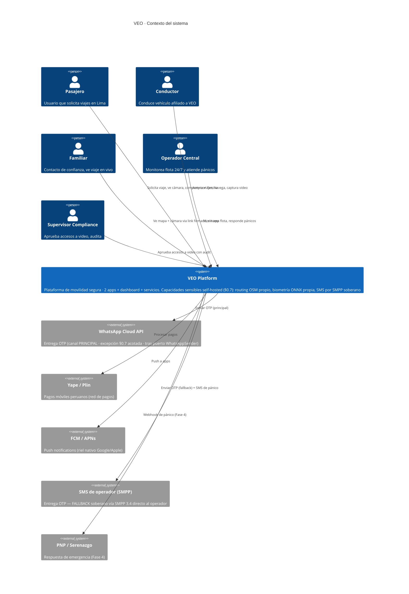

# Diagramas C4 · Nivel 1 (Contexto)

> **Soberanía (§0.7):** routing/geocoding (OSM propio: OSRM/Valhalla + Nominatim vía `@veo/maps`) y biometría
> (`biometric-service` ONNX self-hosted) NO son sistemas externos — viven dentro de `VEO Platform`. Como externos
> quedan SOLO los rieles inevitables legítimos: WhatsApp Cloud API (OTP principal, excepción acotada ADR-012),
> FCM/APNs (push), red de pagos Yape/Plin, y SMS de operador vía SMPP (fallback soberano).

## Otros niveles

- `c4-containers.md` — Nivel 2: containers/servicios (TODO)
- `c4-component-trip.md` — Nivel 3: componentes de trip-service (TODO)
- `c4-component-panic.md` — Nivel 3: componentes de panic-service (TODO)
