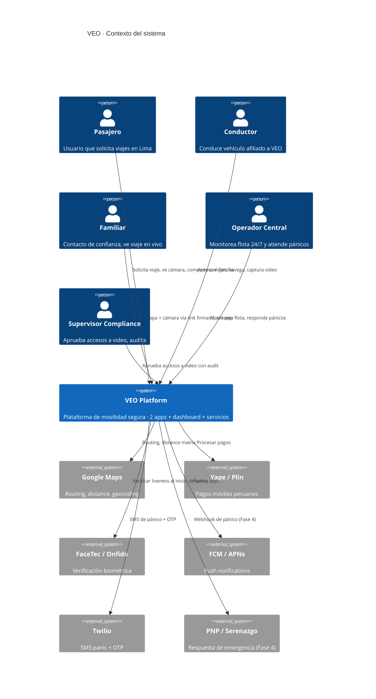

# Diagramas C4 · Nivel 1 (Contexto)

## Otros niveles

- `c4-containers.md` — Nivel 2: containers/servicios (TODO)
- `c4-component-trip.md` — Nivel 3: componentes de trip-service (TODO)
- `c4-component-panic.md` — Nivel 3: componentes de panic-service (TODO)
